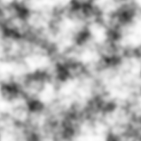

# Simplex Noise Filter
#### By Joshua Sullivan

This package provides 2 new Core Image filters for creating "smooth noise". The filter kernels are written in Metal Shading Language for maximum performance. They require a GPU-accelerated CIContext in order to run.

## SimplexNoiseGenerator


A Metal-based implementation of the 3D Simplex noise generation algorithm. It produces monochromatic noise that varies smoothly in the range [0…1]. Visually, it resembles the ripples on the surface of water.

_Note: The extent produced by this filter is infinite, so you'll need to crop it or use a fixed rendering rect as showin in the usage example._

#### Usage
```
let ciContext = CIContext(...) // Set up using Metal.
let filter = SimplexNoiseGenerator()
filter.contrast = 2.0 // Do any parameter changes you want.
guard 
    let output = filter.outputImage,
    let result = ciContext.createCGImage(
        output, 
        from: CGRect(x: 0, y: 0, width: 512, height: 512)
    )
else { fatalError("Could not render.") }

// result is a CGImage which can be converted into a UIImage, NSImage, or Image
// depending on your platform.
```

## FractalNoiseGenerator



This filter composes multiple "octaves" of Simplex Noise to create a more complex texture, while still retaining the overall smooth transitions. As with the `SimplexNoiseGenerator`, it produces values that vary smoothly in the range [0…1]. Visually, it resembles terrain or clouds.

_Note: The extent produced by this filter is infinite, so you'll need to crop it or use a fixed rendering rect as showin in the usage example._

#### Usage
```
let ciContext = CIContext(...) // Set up using Metal.
let filter = FractalNoiseGenerator()
filter.contrast = 2.0 // Do any parameter changes you want.
filter.octaves = 2
guard 
    let output = filter.outputImage,
    let result = ciContext.createCGImage(
        output, 
        from: CGRect(x: 0, y: 0, width: 512, height: 512)
    )
else { fatalError("Could not render.") }

// result is a CGImage which can be converted into a UIImage, NSImage, or Image
// depending on your platform.
```
